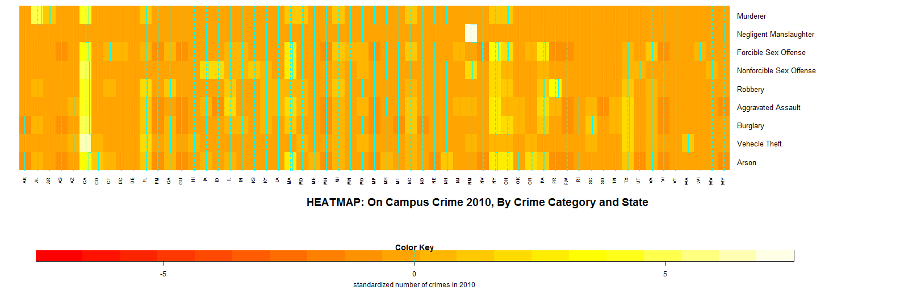
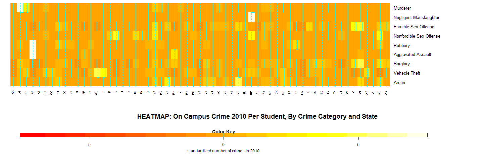

```{r, echo=FALSE, message=FALSE, cache=FALSE, result=FALSE, warning=FALSE, comment=FALSE, warning=FALSE}

library("plotly")
library(corrplot)
library(leaflet)
library(shiny)
library(lattice)
library(circlize)

```

## Introduction
### Backgroud
Crime rate is becoming one of the most concerning problem for college life. It is an issue of safety. As students study on campus, we do care about are living condition. Is the campus safe enough for us? On the other hand, we also want to maintain a broader view such as the crime rate of the city where our university sits, crime pattern for school of same level, as well as the crime rate distribution in the country. To investigate these issues, we conducted this research and created this report.

### Dataset
We use public dataset from data.gov. We discover the a list of datasets for crime. We used falony data from Falony.csv and on campus crime statistic of 2010, 2011, and 2012. Analysis is based on these datasets.

### Techniques
We applied visualization of crime data by its geographical information.

Heatmaps are used in study frequency of crimes in different distrints.

Other statistical methods such as histograms are also used during analysis.

## Nationwide Campus Crime Analysis
### Geospatial Visualization

We first visualized national on campus crime rate, to allow it provide us with an intuitive idea on distribution nationalwide. 

In the plot of On-Campus Crime 2010-2013, we aggregate the total number of crimes by states. We can see that CA, TX, NY are the top three states with most crimes. This pattern matches our intuition since in recent years violence news are quite common in these cities. But does it support that the high number of crime rate for three years in total is only because that these states are unsafe? In other words, is the high crime rate due to the population of these states?

```{r, fig.width=8, fig.height=6,echo=FALSE, warning=FALSE}
#crime by state
oncampus_crime <- read.csv("./oncampuscrime101112.csv")
oncampus_crime = na.omit(oncampus_crime)
crime_2010 = oncampus_crime[,13:21]
crime_2011 = oncampus_crime[,22:30]
crime_2012 = oncampus_crime[,31:39]

state_crime = aggregate(oncampus_crime[,13:39],by=list(oncampus_crime$State), FUN=sum)[-1,]
num_ppl = aggregate(oncampus_crime$Total,by=list(oncampus_crime$State), FUN=sum)[-1,]
crime_total = data.frame(state_crime[,1],rowSums(state_crime[,-1]))
names(crime_total)[1] = "state" 
names(crime_total)[2] = "number_of_crimes"

# give state boundaries a white border
l <- list(color = toRGB("white"), width = 2)
# specify some map projection/options
g <- list(
  scope = 'usa',
  projection = list(type = 'albers usa'),
  showlakes = TRUE,
  lakecolor = toRGB('white')
)

plot_ly(crime_total, z = number_of_crimes, locations = state, type = 'choropleth',
        locationmode = 'USA-states', color = number_of_crimes, colors = 'Purples',
        marker = list(line = l), colorbar = list(title = "Number of Crimes ")) %>%
  layout(title = 'On-Campus Crime 2010-2013', geo = g)

```

With these question in mind, we further normalized the crime occurrence by population of each states. After scaled by population, Plot On-Campus Crime per 1000 Person 2010-2013 turns out that these places are actually relevantly save.

```{r, fig.width=8, fig.height=6,echo=FALSE, warning=FALSE}
#crime by state
oncampus_crime <- read.csv("./oncampuscrime101112.csv")
oncampus_crime = na.omit(oncampus_crime)
crime_2010 = oncampus_crime[,13:21]
crime_2011 = oncampus_crime[,22:30]
crime_2012 = oncampus_crime[,31:39]

state_crime = aggregate(oncampus_crime[,13:39],by=list(oncampus_crime$State), FUN=sum)[-1,]
num_ppl = aggregate(oncampus_crime$Total,by=list(oncampus_crime$State), FUN=sum)[-1,]
crime_total = data.frame(state_crime[,1],rowSums(state_crime[,-1]))
crime_scale = data.frame(state_crime[,1],crime_total[,2]/num_ppl[,2]*1000)
names(crime_scale)[1] = "state" 
names(crime_scale)[2] = "number_of_crimes_per_1000_person"


library(plotly)

# give state boundaries a white border
l <- list(color = toRGB("white"), width = 2)
# specify some map projection/options
g <- list(
  scope = 'usa',
  projection = list(type = 'albers usa'),
  showlakes = TRUE,
  lakecolor = toRGB('white')
)

plot_ly(crime_scale, z = number_of_crimes_per_1000_person, locations = state, type = 'choropleth',
        locationmode = 'USA-states', color = number_of_crimes_per_1000_person, colors = 'Purples',
        marker = list(line = l), colorbar = list(title = "Number of Crimes Per 1000 Person")) %>%
  layout(title = 'On-Campus Crime 2010-2013', geo = g)

```

Now we can see that such states as VT, WV, CT, MA are among the most unsafe ones, with more than 6 crime per 1000 people. Other states are relatively safe. We further visualized a distribution of crime on google map API in the Appendix. There you can have more information about the distribution by longtitude and latitude. 

### Heatmap Analysis
Two kinds of heatmap are generated form analysis.

The heatmap generated by Google Map API ([CLICK HERE TO SEE THE MAP](./final_crime.html)) shows the distribution of all on-campus crimes happened between 2010 and 2012. One may observe that the New York Area and the Los Angeles Area are the two metropolitan areas with most on-campus crimes. This is largely due to the high number of schools and large student population in California and New York, with 1040 and 593 schools in report respectively.  There are about 5.7 million students in California and 2.6 million students in New York. 

Another kind of heatmap below breaks down the on-campus crimes in 2010 by categories. Cells with brighter color suggests more incidents. Consistent with previous results, the CA and NY have brighter cells for most categories in the first plot. However, when adjusted for student populations, one can see that New Mexico has a higher rate of Negligent Manslaughter and Nonforcible Sexual Offense. The rate of Arson-related crimes is way above the average in New Hampshire. In addition, the probability of getting a car stolen on campus is relatively higher in Hawaii than in other states. 

<div id="bg">
  
  
</div>  

### Statistical Analysis

Statistical Analysis provides us with more quantitative prooves in mining patterns behind the data. Nationwide crime map makes us wonder: now that we have witness the spatial distribution of crime, could we also find some pattern by other categories?

Thus we tried to find out if the average number of oncampus crime for a university is related with its type, i.e. whether school type such as public school, private college would have different crime occurrence patterns.

```{r, fig.width=8, fig.height=6,echo=FALSE, warning=FALSE}
file <- read.csv("./oncampuscrime101112.csv", header = TRUE)


new_file <- file[complete.cases(file),]
type_data <- data.frame(new_file$Sector_desc, new_file$MURD10)

for (i in 1:dim(new_file)[1]){
  type_data[i,2] = sum(new_file[i, 13:39])
}
a <- aggregate(type_data$new_file.MURD10, by = list(Category = type_data$new_file.Sector_desc), FUN = sum)


a1 = a[1,2]/table(new_file$Sector_desc)[3]
a2 = a[2,2]/table(new_file$Sector_desc)[4]
a3 = a[3,2]/table(new_file$Sector_desc)[5]
a4 = a[4,2]/table(new_file$Sector_desc)[6]
a5 = a[5,2]/table(new_file$Sector_desc)[7]
a6 = a[6,2]/table(new_file$Sector_desc)[8]
a7 = a[7,2]/table(new_file$Sector_desc)[9]
a8 = a[8,2]/table(new_file$Sector_desc)[10]
a9 = a[9,2]/table(new_file$Sector_desc)[11]

final <- data.frame(c(a1,a2,a3,a4,a5,a6,a7,a8,a9))
average_number_of_crime_per_university = final$c.a1..a2..a3..a4..a5..a6..a7..a8..a9.
university_type = names(c(a1,a2,a3,a4,a5,a6,a7,a8,a9))


f <- list(
  family = "Courier New, monospace",
  size = 15,
  color = "#7f7f7f"
)
f1 <- list(
  family = "Old Standard TT, serif",
  size = 10,
  color = "black"
)
f2 <- list(
  family = "Old Standard TT, serif",
  size = 7,
  color = "black"
)
x <- list(
  title = "university type",
  titlefont = f,
  tickfont = f2
)
y <- list(
  title = "average number of crime per university",
  titlefont = f,
  tickfont = f1
)
plot_ly(x=university_type, y = average_number_of_crime_per_university, mode = "markers") %>% layout(title = "university type vs. average number of crime per university", xaxis = x, yaxis = y)


```


From this plot, we found that public universities with 4 years and above have pretty higher number of oncampus crime compared with other types of university, which is about 38 oncampus crime for one university over three years(2010-2012). While "Private nonprofit, 4-year or above" universities have the second highest number of oncampus crime. Other types of universities have relatively low number of crime, which are below 5 crimes per university over three years.

This indicates that public school is now enduring serious crime issues, and we do need to take some actions.

```{r, fig.width=6, fig.height=6,echo=FALSE, warning=FALSE}
oncampus_crime <- read.csv("./oncampuscrime101112.csv")
oncampus_crime = na.omit(oncampus_crime)
crime_2010 = oncampus_crime[,13:21]
crime_2011 = oncampus_crime[,22:30]
crime_2012 = oncampus_crime[,31:39]

# circlize plot

m = cor(crime_2012)
diag(m) = 0
colnames(m) = c("Murder","Manslaughter","Forcible Sex Offense","Nonforcible Sex Offense",
"Robbery","Assault","Burglary","Vehicle Theft","Arson")
rownames(m) = c("Murder","Manslaughter","Forcible Sex Offense","Nonforcible Sex Offense", "Robbery","Assault","Burglary","Vehicle Theft","Arson")

# set the colors
#groupColors <- c("#66C2A5", "#A6D854", "#FFD92F", "#F26223","#FF0000","#E78AC3",
#                 "#FC8D62","#8DA0CB","#FFDD89")

#plot
chordDiagram(m)

```

Moreover, we try to find the correlation between each crime types, to see whether the occurrence of one type will lead to the rise and falls of others. We use a chord diagram to plot our correlation matrix. From this plot we can discover that there are strong correlation between occurrence of Bulgary and Sex Offense, and of Robery and Vehicle Theft. This might provide us with some ideas on crime prevention.

## Analysis on New York City Crime

We all hear the saying that New York City is one of the least safest cities in US. It is so notorious that even police would name one district as "Hells Kitchen". As Columbia students, we coudn't ignore analysis on NYC crime circumstances so as to provide with suggestions on living in NYC. After that, we will focus on Columbia University.
```{r, fig.width=10, fig.height=4,echo=FALSE, warning=FALSE}
##explore NYC crime
nyc_data=read.csv("./Felony.csv")
nyc_data=na.omit(nyc_data)
nyc_data=nyc_data[nyc_data$OccurrenceYear==2015,]
data1=nyc_data[,c(5,12,16)]
district=rownames(table(data1$Borough))[-1]
occur_month=c('Jan','Feb','Mar','Apr','May','Jun','Jul','Aug','Sep')
crime_type=c('GRAND LARCENY','FELONY ASSAULT','ROBBERY','BURGLARY')

number_list=c()
i=1
for (x in occur_month){
  for (y in crime_type){
    for (z in district){
      number=sum(data1$OccurrenceMonth==x & data1$Offense==y & data1$Borough==z)
      number_list[i]=number
      i=i+1
    }
  }
}

month_list=rep(c(1:9),each=20)
crime_type_list=rep(rep(crime_type,each=5),9)
district_list=rep(district,36)
data1=data.frame(format(month_list,format="b%"),crime_type_list,district_list,number_list)
colnames(data1)=c('Month','Crime_Type','District','Number')

library(ggplot2)
library(reshape)

ggplot(data1, aes(x = Month, y=Number, fill = District)) +
  geom_bar(width = 1, position="identity", stat="identity", color="black") + 
  scale_y_sqrt() + #facet_grid: Lay out panels in a grid
  facet_grid(. ~ Crime_Type, scales="free",labeller = label_both) + coord_polar(start=3*pi/2) +
  ggtitle("2015 January-September NYC Crime Investigation") + 
  scale_fill_brewer(palette = "RdYlGn")+
  xlab("")


```

First of all, the graph shows that grand larceny has the largest number among all kinds of crimes, while burglary, felony assault and robbery have similar number.

Secondly, burglary, felony assault and robbery are most serious in Brooklyn, while grand larceny is most serious in Manhattan. Among those 5 districts of New York City, Staten Island is the satest place.

There is no clear time pattern exits in the data. Crime numbers in different months maintain similar level.  

```{r, fig.width=8, fig.height=6,echo=FALSE, warning=FALSE}
Felony <- read.csv("./Felony.csv", header = TRUE)
new_felony <- Felony[Felony$OccurrenceYear == "2015",]

offense <- as.factor(new_felony$Offense)
levels(offense) <- 1:length(levels(offense))

borough <- as.factor(new_felony$Borough)
levels(borough) <- 1:length(levels(borough))

both <- data.frame(as.numeric(offense),new_felony$Offense,as.numeric(borough),new_felony$Borough)

mat <- matrix(0,nrow = 6,ncol = 7)

for (i in 1:6){
  for (j in 1:7){
    mat[i,j] = nrow(both[both$as.numeric.offense.==j & both$as.numeric.borough.==i,])
  }
}
  
rownames(mat) <- c(levels(both$new_felony.Borough))
colnames(mat) <- c(levels(both$new_felony.Offense))
mat = mat[-1,]

for (i in 1:7){
  mat[,i] = mat[,i]/summary(both$new_felony.Offense)[i]
}

corrplot(mat, method = "color", tl.cex = 1, is.corr = FALSE, tl.col = "black", mar=c(0,0,1,0), title = "Distribution of Offense in each district")

```

From felony dataset, we also tried to find out which district has a higher rate of different type of offense. In the plot, we can easily conclude that Staten Island has the lowest rate of all types of offense, which may caused by its lowest rate of population in new york city. While Brooklyn has the highest rate of most type of offense including Burglary, felony assault, grand larceny of motor vehicle, murder, rape and robbery, which makes sense since Manhattan has the highest population in New York City. Among this, about 39% of murder cases happened in Brooklyn from Jan 2015 to Sept 2015. In addition, Manhattan has the highest rate of grand larceny.

### Crime at Columbia
```{r, fig.width=8, fig.height=6,echo=FALSE, warning=FALSE}

crime = read.csv("./Felony.csv")
crime_2015 = crime[crime$OccurrenceYear==2015,]
crime_columbia = crime_2015[crime_2015$Longitude>-73.98,]
crime_columbia = crime_columbia[crime_columbia$Longitude< -73.95,]
crime_columbia = crime_columbia[crime_columbia$Latitude<40.813,]
crime_columbia = crime_columbia[crime_columbia$Latitude>40.80,]

crimes = as.data.frame(table(crime_columbia$Offense))
colnames(crimes) = c("Type","Frequency")
Type = crimes$Type
Frequency=crimes$Frequency
s = list(
  l = 50,
  r = 50,
  b = 100,
  t = 100,
  pad = 4
)
plot_ly(x=Type,y=Frequency,type = "bar",color = Type)%>%
  layout(autosize = F, width = 480, height = 480, margin = s,showlegend = FALSE,
         title = "Different Types of Crimes Near Columbia University")

```

We want to find the distribution of different types near Columbia university in year 2015.
The bar chat shows the number of each type of crimes. It turns out that Grand Larceny is the top one. So we further visualized the Grand Larceny on map to keep students aware of potential location with high crime occurrence frequency.

```{r, fig.width=8, fig.height=6,echo=FALSE, warning=FALSE}
crime_columbia_larceny = crime_columbia[crime_columbia$Offense=="GRAND LARCENY",]
leaflet(data = crime_columbia_larceny) %>% addTiles() %>%
  addMarkers(~Longitude, ~Latitude, popup = "Columbia University")
```


## Case Study: An Ivy League Comparison

Columbia University is one member of the Ivy League. Ivy League originates from the football association between these universities in US back to 200 years ago. Schools in the league competes heavily to win the first place in physical activities. Nowadays they represents the highest quality private schools in this country, while the sense of competition remains.

Thus it is highly meaningful to study and compare crime patterns between Ivy Leagues. Would there be any differences between the Ivy universities? With this question in mind, we started to first investigate On Campus Crime for these schools.

```{r,fig.width=8, fig.height=6, echo=FALSE, warning=FALSE}
data=read.csv("./project3.csv")
data=na.omit(data)

##Trellis plot

#Columbia Univerty 
Columbia_index=grepl("Columbia University",data[,2])
Columbia_data=data[Columbia_index,][,13:39]
Columbia_data=colSums(Columbia_data)
Columbia_people=data[Columbia_index,][,12]
Columbia_people=Columbia_people[1]+Columbia_people[5]

#Cornell University 
Cornell_index=grepl("Cornell University",data[,2])
Cornell_data=data[Cornell_index,][,13:39]
Cornell_people=data[Cornell_index,][,12]


#Dartmouth College 
Dartmouth_index=grepl("Dartmouth College",data[,2])
Dartmouth_data=data[Dartmouth_index,][,13:39]
Dartmouth_people=data[Dartmouth_index,][,12]

#Brown University
Brown_index=data[,2]=='Brown University'
Brown_data=data[Brown_index,][,13:39]
Brown_people=data[Brown_index,][,12]

#University of Pennsylvania 
Pennsylvania_index=data[,2]=='University of Pennsylvania'
Pennsylvania_data=data[Pennsylvania_index,][,13:39]
Pennsylvania_people=data[Pennsylvania_index,][,12]

#Harvard University
Harvard_index=grepl("Harvard University",data[,2])
Harvard_data=data[Harvard_index,][,13:39]
Harvard_data=colSums(Harvard_data)
Harvard_people=data[Harvard_index,][,12][1]

#Yale University
Yale_index=data[,2]=='Yale University'
Yale_data=data[Yale_index,][,13:39]
Yale_people=data[Yale_index,][,12]


#Princeton University
Princeton_index=grepl("Princeton University",data[,2])
Princeton_data=data[Princeton_index,][,13:39]
Princeton_data=colSums(Princeton_data)
Princeton_people=data[Princeton_index,][,12][1]

#Ivy League
Ivy_league_matrix=c(Columbia_data,
                             Cornell_data,
                             Dartmouth_data,
                             Brown_data,
                             Pennsylvania_data,
                             Harvard_data,
                             Yale_data,
                             Princeton_data)


schools=c('Columbia University',
          'Cornell University',
          'Dartmouth College',
          'Brown University',
          'University of Pennsylvania',
          'Harvard University',
          'Yale University',
          'Princeton University')


universities=rep(schools,each=27)
years=rep(rep(c(2010,2011,2012),each=9),8)
type=rep(c('Murder','Negligent Manslaughter','Forcible Sex Offense','Nonforcible Sex Offense','Robbery','Aggravated Assault','Burglary','Motor Vehicle Theft','Arson'),24)
university_people_number=c(Columbia_people,
                      Cornell_people,
                      Dartmouth_people,
                      Brown_people,
                      Pennsylvania_people,
                      Harvard_people,
                      Yale_people,
                      Princeton_people)
People_number=rep(university_people_number,each=27)
crime_per_1000_person=1000*unlist(matrix(Ivy_league_matrix,ncol=1))/People_number
  
Ivy_league_data=data.frame(universities,years,type, matrix(Ivy_league_matrix,ncol=1),People_number,crime_per_1000_person)
colnames(Ivy_league_data)=c('University','Year','type','number',"number_of_people",'crime_per_1000_people')

##Trellis plot of total crime number


dotplot(type~number|University,data=Ivy_league_data,group=Year,pch=c(1,2,3),col=c('blue','red','orange'),layout=c(2,4),main='Ivy League Crime Investigation',ylab='Crime Type',
        key=list(space='right',transparent=T,points=list(pch=c(1,2,3),col=c('blue','red','orange')),text=list(c('2010','2011','2012'))))
```

From the plot we can see that Columbia University's security it not optimistic. Although it has low crime rates on robbery, nonforcible sex offense, negligent manslaughter, murder, and motor vehicle theft, but it has very high forcible sex offense and burglary rates. Moreover, although aggravated assault in Columbia University is rare but it happens every year. For the other 7 colleges in the Ivy League, Yale University, Harvard University, Princeton University and Brown University are also in Columbia University's predicament, all of them have abnormal high forcible sex offense and bulglary rates. 

We can also extract from the plot that all Ivy League colleges except University of Pennsylvania and Yale University maintain low robbery, nonforcible sex offense, negligent manslaughter, murder and motor vehicle theft rates. University of Pennsylvania has high robbery crime rate while motor vehicle theft is common in Yale University. Forcible sex offense and burglary are also common in Cornell University and Dartmouth College even though they are the two safest Ivy League universities.

However, above conclusions can be inaccurate because each university has different numbers of people. Therefore, we want to normalize the crimes on the number of people. 

```{r, fig.width=8, fig.height=6,echo=FALSE, warning=FALSE}
##Trellis plot of crime per 1000 people
dotplot(type~crime_per_1000_people|University,data=Ivy_league_data,group=Year,pch=c(1,2,3),col=c('blue','red','orange'),layout=c(2,4),main='Ivy League Crime Investigation',ylab='Crime Type',
        key=list(space='right',transparent=T,points=list(pch=c(1,2,3),col=c('blue','red','orange')),text=list(c('2010','2011','2012'))))
```

Surprisingly, after the normalizing, Columbia University becomes one of the safest schools in Ivy League. Brown University has the highest number of burglary per 1000 people, while Princeton University has the highest number of forcible sex offense per 1000 people. We suggest  each university to take more effective actions to prevent oncumpus forcible sex offense and burglary.

Next we seperate above plot by years in order to detect time pattern.

```{r,fig.width=8, fig.height=6, echo=FALSE, warning=FALSE}
dotplot(type~crime_per_1000_people|University,data=Ivy_league_data[Ivy_league_data$Year==2010,],layout=c(2,4),main='Ivy League 2010 Crime Investigation',ylab='Crime Type')
dotplot(type~crime_per_1000_people|University,data=Ivy_league_data[Ivy_league_data$Year==2011,],layout=c(2,4),main='Ivy League 2011 Crime Investigation',ylab='Crime Type')
dotplot(type~crime_per_1000_people|University,data=Ivy_league_data[Ivy_league_data$Year==2012,],layout=c(2,4),main='Ivy League 2012 Crime Investigation',ylab='Crime Type')

```

Yale University has fewer forcible sex offense cases in 2010, while Dartmouth College has both fewer burglary and arson cases in 2010.

In 2011, motor vehicle theft in Yale University increased dramatically compare to 2010. In comparison, motor vehicle theft in Princeton University decreased to 0 in 2011. But forcible sex offense in Princeton University increased rapidly. 

In 2012, burglary in Brown University seems had been effectively controlled, but its forcible sex offense increased dramatically at meantime. Burglary in Yale University also increased rapidly during 2012.

Although number of crimes changed in different years, but we did not detect any clear time pattern in the data. 

Because many Columbia students also living off campus, next we want to explore the crime situation of New York City in 2015 from January to September. 


## Conclusion
In this report, we analyzed crime circumstances in US, especially on campus crime occurrence. We investigated the relationship of crime occurrence by state and by school. We studied crime statistics on New York City. We further pointed out the most serious crime issue in Columbia University and provided with map to remind students of potential danger. Case study into Ivy League crime rate also gives us some ideas on crimes pattern at each school.

